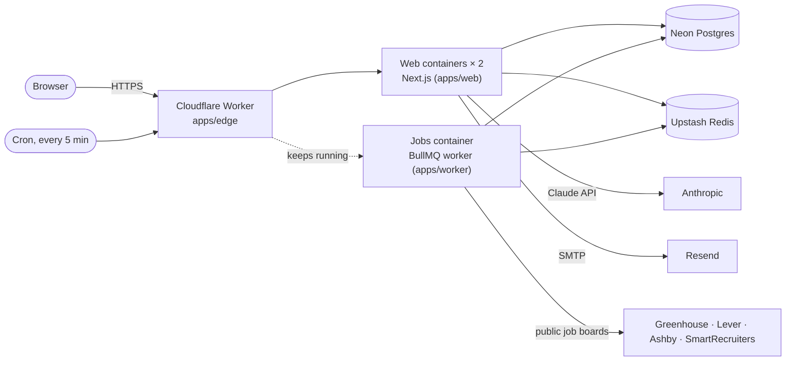

# Deploy NextRole on Cloudflare

NextRole runs on Cloudflare as a Worker in front of two containers built from this repository's
Dockerfiles. Postgres and Redis are managed services outside Cloudflare, and Claude is called from
the server with your API key.



- **Worker** (`apps/edge`): receives every request, redirects HTTP to HTTPS, passes the visitor's
  real IP to the app, and spreads traffic across the web containers.
- **Web containers**: the Next.js server from `apps/web/Dockerfile`. Two run by default.
- **Jobs container**: the background worker from `apps/worker/Dockerfile`. A cron trigger starts
  it after each deploy and it never idles out, so job boards sync every 10 minutes.
- **Deploys**: the GitHub Actions `Deploy` workflow runs after CI passes on `main`. It applies
  database migrations, adds any missing default job boards, builds and uploads both images with
  `wrangler deploy`, uploads the secrets, and checks `/api/health` on the live site.

## 1. Create the accounts

| Service                                    | Used for                                        | Plan                                                            |
| ------------------------------------------ | ----------------------------------------------- | --------------------------------------------------------------- |
| [Cloudflare](https://dash.cloudflare.com)  | Worker, containers, domain                      | **Workers Paid** ($5/month), which Containers require           |
| [Neon](https://neon.tech)                  | PostgreSQL database                             | Free tier is enough to start                                    |
| [Upstash](https://upstash.com)             | Redis for job queues and rate limits            | Pay-as-you-go (the job queues send a steady stream of commands) |
| [Anthropic](https://console.anthropic.com) | Claude API                                      | Pay per use; set a monthly spend limit in the console           |
| [Resend](https://resend.com)               | Email: sign-up verification and password resets | Free tier; verify the domain you send from                      |

What to copy from each:

- **Cloudflare**: your **Account ID** (shown on the Workers & Pages overview), and an **API
  token** created from the "Edit Cloudflare Workers" template with the **Containers** edit
  permission added, which the deploy needs to upload the images.
- **Neon**: create a project on Postgres 16 and copy the **direct** (not pooled) connection string.
  It ends in `?sslmode=require`.
- **Upstash**: create a Redis database with TLS and copy its `rediss://default:…@…:6379` URL. Leave
  eviction off; the job queues need every key kept.
- **Anthropic**: create an API key.
- **Resend**: verify your domain, create an API key, and build
  `smtps://resend:<API key>@smtp.resend.com:465`.

## 2. Choose the address

Your app's public URL is `APP_URL`. It must match exactly what visitors use, because sign-in only
accepts requests from that origin.

- **workers.dev**: `https://nextrole.<your-subdomain>.workers.dev`. Your subdomain is shown under
  Workers & Pages in the Cloudflare dashboard.
- **Your own domain** (for example `https://nextrole.sundhar.io`): the domain must use Cloudflare
  DNS. After the first deploy, open the `nextrole` Worker's settings, add the custom domain under
  Domains & Routes, then change `APP_URL` and run the deploy again.

## 3. Add the GitHub secrets and variables

In the repository on GitHub, open **Settings → Secrets and variables → Actions**.

**Secrets**

| Name                                       | Value                                    |
| ------------------------------------------ | ---------------------------------------- |
| `CLOUDFLARE_API_TOKEN`                     | The Cloudflare API token                 |
| `CLOUDFLARE_ACCOUNT_ID`                    | The Cloudflare account ID                |
| `DATABASE_URL`                             | The Neon connection string               |
| `REDIS_URL`                                | The Upstash `rediss://` URL              |
| `BETTER_AUTH_SECRET`                       | Output of `openssl rand -base64 48`      |
| `ENCRYPTION_KEY`                           | Output of `openssl rand -base64 32`      |
| `ANTHROPIC_API_KEY`                        | The Claude API key                       |
| `SMTP_URL`                                 | The Resend SMTP URL                      |
| `GOOGLE_CLIENT_ID`, `GOOGLE_CLIENT_SECRET` | Optional: enables "Continue with Google" |

**Variables**

| Name                 | Value                                                                                      |
| -------------------- | ------------------------------------------------------------------------------------------ |
| `APP_URL`            | The public URL from step 2, for example `https://nextrole.example.workers.dev`             |
| `EMAIL_FROM`         | Sender on your verified domain, for example `NextRole <no-reply@sundhar.io>`               |
| `AI_MODEL`           | Optional: `claude-sonnet-5` costs about 60% less per call than the default `claude-opus-5` |
| `ANTHROPIC_BASE_URL` | Optional: route Claude calls through Cloudflare AI Gateway (see below)                     |

With the GitHub CLI, the two generated secrets can be set without ever displaying them:

```bash
gh secret set BETTER_AUTH_SECRET --body "$(openssl rand -base64 48)"
gh secret set ENCRYPTION_KEY --body "$(openssl rand -base64 32)"
```

Set these two once and keep them. Changing `BETTER_AUTH_SECRET` signs everyone out, and changing
`ENCRYPTION_KEY` makes stored encrypted data unreadable.

## 4. Deploy

1. Open **Actions → Deploy → Run workflow** on `main`. The first run takes about 10 minutes
   because it builds both images.
2. When it finishes, the smoke test has already checked `APP_URL/api/health`. Open `APP_URL`, sign
   up and confirm your email.
3. Make yourself an admin in Neon's SQL editor:
   `update users set role = 'admin' where email = 'you@example.com';`

After that, every push to `main` deploys automatically once CI passes.

## Operating it

- **Logs**: in the Cloudflare dashboard, open the `nextrole` Worker for request logs and the
  Containers page for the container output. Both apps log structured JSON.
- **Health**: `GET /api/health` checks Postgres and Redis from a web container.
- **Scale**: `WEB_INSTANCES` and each container's `instance_type` and `max_instances` live in
  `apps/edge/wrangler.jsonc`. Keep `max_instances` above `WEB_INSTANCES` to leave room for
  rolling updates.
- **Cost**: the cron trigger keeps both web containers and the jobs container running. Set
  `KEEP_WARM` to `"false"` to let idle web containers sleep. That is cheaper, but the first visit
  after a quiet period waits for a container to start. Container time is billed on top of the
  Workers Paid plan; see Cloudflare's Containers pricing.
- **Claude spend**: every call's cost is stored in the `ai_usage` table and capped per user by plan.
  To also get Cloudflare's usage dashboards, caching and rate limits, create an AI Gateway in the
  Cloudflare dashboard and set the `ANTHROPIC_BASE_URL` variable to
  `https://gateway.ai.cloudflare.com/v1/<account id>/<gateway name>/anthropic`.
- **Roll back**: revert the change on `main` (the deploy runs again), or roll back to an earlier
  version from the Worker's Deployments page in the dashboard.
- **Removed settings**: deploys add and update secrets but never delete them. Remove one with
  `pnpm --filter @nextrole/edge exec wrangler secret delete <NAME>`.

## Trying it locally

`pnpm --filter @nextrole/edge cf:dev` runs the Worker and both containers on your machine with
Docker. Put the settings in `apps/edge/.dev.vars` (ignored by git), using the same names as the
secrets above, with `APP_URL=http://localhost:8787`.
